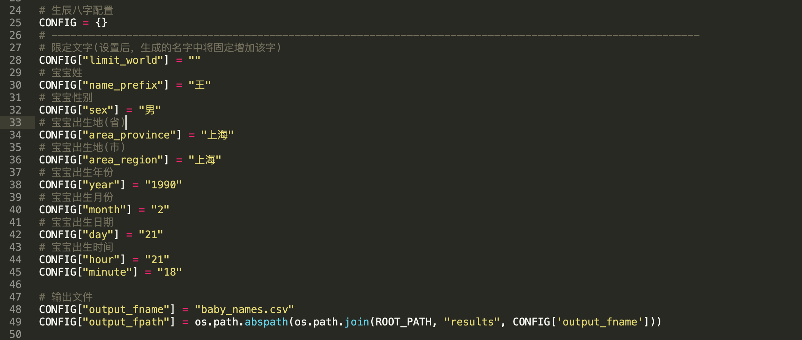
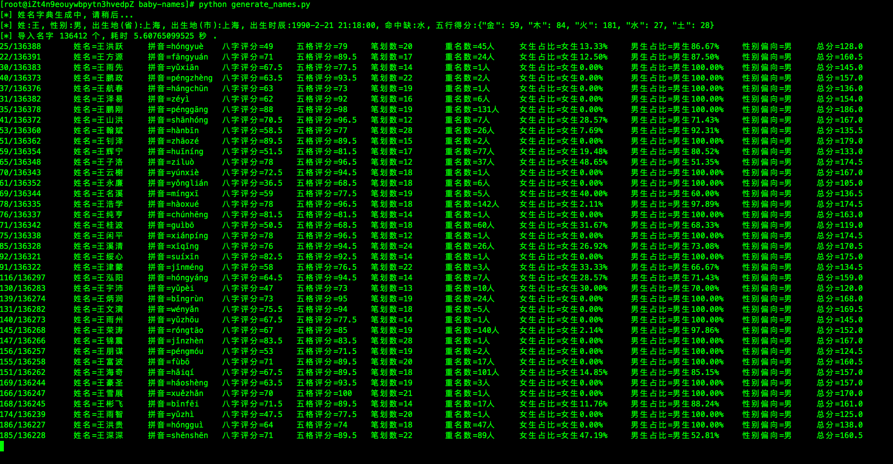
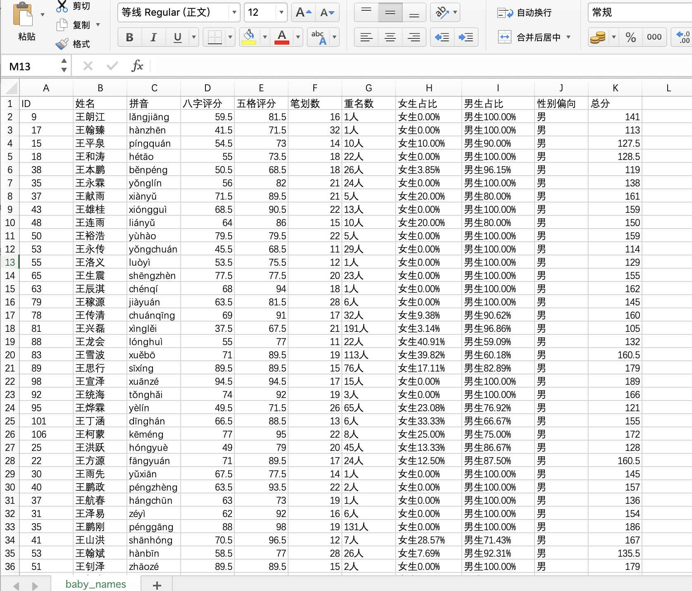
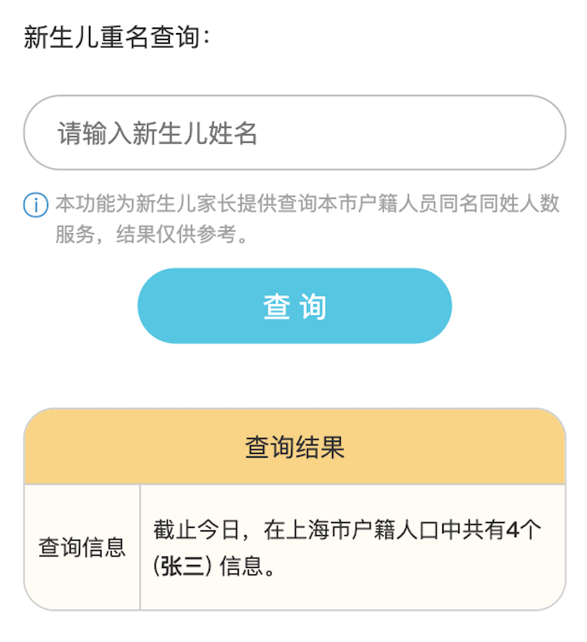
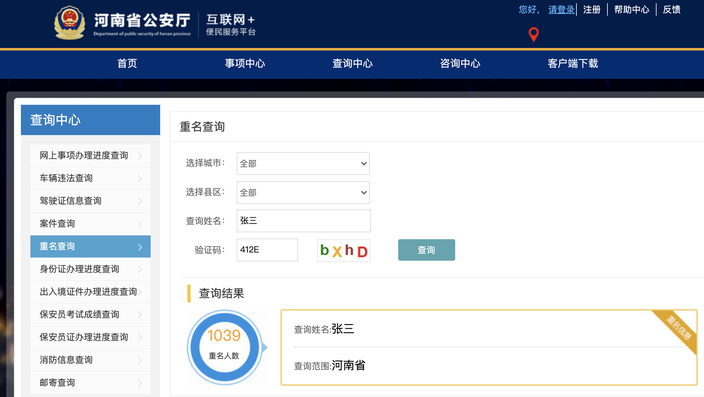
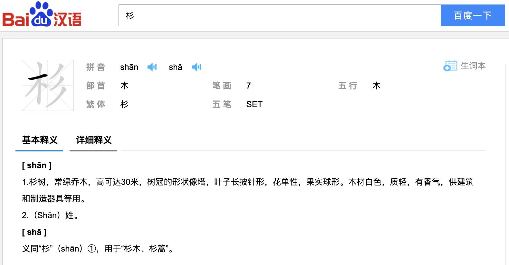
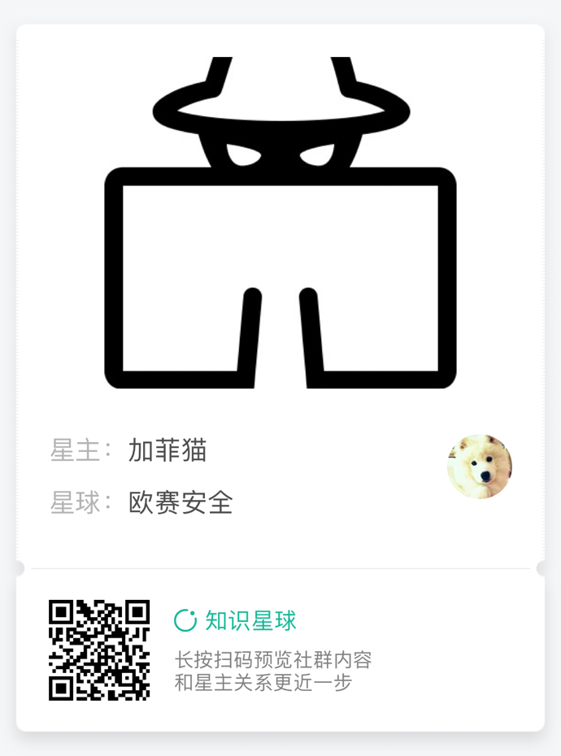

# Baby-Names(程序员五行八卦取名大法)
------
谨以此献给天下所有的新手奶爸们，祝各位父亲节快乐。同时也祝愿我家刚出生的小公主能够健康快乐的成长～ 

PS：还没宝宝的准奶爸们，先Star，以后用的到。: )

## 使用说明
- **首先克隆项目到本地：
> git clone https://github.com/callmefeifei/baby-names.git**

- **安装以下依赖库.**

> sudo pip install -i http://pypi.douban.com/simple/ --trusted-host=pypi.douban.com -r docs/requirements.txt

- **在Python2.x环境运行**

- **参数配置**

需根据各家情况，配置宝宝性别、生辰八字、出生地等信息.



- **运行界面**

完成上述配置后, 执行以下命令即可: python generate_names.py



- **输出结果**

运行完毕或运行一段时间后，可以打开csv结果文件(默认在results/baby_names.csv)，由大到小排序最后一列总分、然后按照需要由少到多排序重名数、笔划数，从中选出你认为不错的、有寓意的名字。



------
## * 关于起名 *
写此代码的缘由，一方面是由于自家宝宝马上要出生啦（发文时宝宝刚好已经出生一周），同时身边也有几个朋友的宝宝都扎堆要一起出生，当新生宝宝出生后，大人们为宝宝要做的第一件重要的事，想必便是起一个好听的、有寓意的名字了。然鹅问了下身边有宝宝将要出生的，都还没起名字，于是乎，对于程序员奶爸的我来说，能有机会写个程序来做个助攻，那必然是不能闲着的啊，由此有了此文。

每个家庭给孩子取名字的思路是不一样的，有的会选择使用最传统的起名大法从名著中查找，口诀 “文论语，武周易；女诗经，男楚辞”，历史上很多名人的姓名确实也很多出自于此，比如诺奖得主屠呦呦，见《诗经·小雅》：“呦呦鹿鸣，食野之蒿”。这个不在接下来写代码时的考虑范畴，就不多讲啦。

有的老一辈也讲究查看宝宝生辰八字，会建议宝爸宝妈根据新生儿的生辰八字、生肖属相找人去算一下宝宝的五行、命格，并根据五行强弱在名字上做文章弥补，比如有的人五行缺木，则会在名字中选一个带木字偏旁的。对于现在这些接受过现代化科学教育的朋友们来说，这种封建迷信大多人还是持怀疑态度的，but，正所谓宁可信其有，不可信其无，笔者的父母比较信这个的，所以在接下来的代码实现里，也还是加入了生辰八字相关因素，毕竟能够起到即好听、又有寓意、又能够贴合八字评分的，大家都满意，何乐而不为呢？

## * 需求分析 *
我们都知道，程序的诞生，一定是由用户需求来驱动的，有了需求才能明确方向。于是乎我先去问了下家里的产品经理（老婆和家人）对于小孩名字有啥要求，然后收集到答复(需求)如下：

> - 名字要好听；
> - 名字不要烂大街(重名不要太多);
> - 名字尽量不要太难写，笔划适当;
> - 最好能够贴合生辰属相、五行八字;
> - 评测网站上打分不要太低;

## * 实现过程 *
需求明确了，那么就开动去一个个实现吧。
### 1、名字好听
选择好听的名字前，首先我们要有名字字典列表去选择，本着能不造轮子就不造轮子的优秀思想(懒...)，这里我直接在万能的Github上找到了其他同学写的起名代码及名字字典进行改造(见LICENSE)，这里原作者整理了男、女宝宝常用的汉字字典，见dicts/boys_double.txt、dicts/boys_single.txt、dicts/girls_double.txt、dicts/girls_single.txt, 分别对应男孩双字字典、男孩单字字典、女孩双字字典、女孩单字字典。

然后通过用户性别设置，选择对应的字典文件，导入双字字典的同时，递归遍历单字字典，生成更多的对应性别姓名库。经过匹配组合后，即可生成一批姓名列表供筛选出好听的姓名啦。**这块主要知识点是程序对文件的读取、递归遍历单字字典生成所有双字姓名** 这块没太多好说的，直接看`get_all_names`方法即可.

### 2、不能重名太多
有了姓名列表了，如何查看每个姓名的大致重名情况呢？我们其实在各地官方都能找到查看重名的入口，如,

**上海** : https://shanghaicity.openservice.kankanews.com/citizen-html/index.html



**河南** : http://bsdt.henanga.gov.cn/MainPages/ChaXunZhongXin/SameNameQuery



**人人网** : 考虑到后边查询的姓名库较多，为了不被封且不对官方系统产生压力，最终选用了人人网的接口来获取重名参考数据**


***重名这部分代码主要基于人人网来进行分析，这里知识点主要是对BeautifulSoup、re正则的使用, 通过获取指定姓名的查询结果，使用BeautifulSoup提取所需元素的对应信息，使用正则匹配具体数字即可.***
```python
# 查看重名(通过人人网)
def check_duplicate_names(self, name):
    if self.is_check_duplicate_name:
        url = "http://name.renren.com/tongMing/search"
        params = {}
        params["q"] = name
        params["cx"] = "014540359382904656588:9tf8clwp-ki"
        params["ie"] = "UTF-8"

        try:
            resp = requests.post(url=url, data=params, headers=self.headers, timeout=10, allow_redirects=False)
            if resp.status_code == 301:
                next_url = resp.__dict__['headers']['location']
                body = requests.get(url=next_url, headers=self.headers, timeout=10).content

                # 解析同名数量
                soup = BeautifulSoup(body, 'html.parser')
                duplicate_result = soup.find_all("p", class_="search_tip")

                if duplicate_result:
                    for node in duplicate_result:
                        node_cont = node.get_text()
                        names_total = node.find_all("font")[1].get_text()
                        girls_total = node.find_all("font")[2].get_text()
                        boys_total = node.find_all("font")[3].get_text()
                else:
                    names_total = "0人" 
                    girls_total = "女生0.00%"
                    boys_total = "男生0.00%"
            else:
                names_total = "0人" 
                girls_total = "女生0.00%"
                boys_total = "男生0.00%"
        except Exception as err:
            names_total = "0人" 
            girls_total = "女生0.00%"
            boys_total = "男生0.00%"
            print 1111,err

        girls_num = re.findall("\d*\.\d*", girls_total)[0]
        boys_num = re.findall("\d*\.\d*", boys_total)[0]

        # 名字性别偏向
        name_sex = ""
        if int(float(girls_num)) > int(float(boys_num)):
            name_sex = "女"
        elif int(float(boys_num)) > int(float(girls_num)):
            name_sex = "男"
        else:
            name_sex = "中性"
    else:
        names_total = "0人" 
        girls_total = "女生0.00%"
        boys_total = "男生0.00%"
        name_sex = "未知"

    return names_total, girls_total, boys_total, name_sex
```

### 3、笔划数适当
接下来解决笔划数，这个很简单，直接找了一个Python第三方库"cjklib"，然后调用第三方库的方法算出名字中的笔划数即可。**该部分知识点主要为对第三方库的使用**
```
def online_compute_score(self, _fieldnames, name_postfix, cur_idx, shengyushu):
    # 识别笔划数
    if len(name_postfix) > 3:
        _pinyin = pinyin(u'%s' % name_postfix)[0][0] + pinyin(u'%s' % name_postfix)[1][0]
        try:
            bihua = cjk.getStrokeCount(u"%s" % name_postfix[:3]) + cjk.getStrokeCount(u"%s" % name_postfix[-3:])
        except:
            bihua = 0

    else:
        _pinyin = pinyin(u'%s' % name_postfix)[0][0]
        try:
            bihua = cjk.getStrokeCount(u"%s" % name_postfix[-3:])
        except:
            bihua = 0

```

### 4、姓名八字测评
生成了姓名库、查看了重名、获取了笔划数，接下来就要对名字进行打分啦，这里我使用了"[起名网][1]"进行打分查询.

**这部分主要知识点**:
> - POST表单提交: 这里起名网需要POST提交表单, 我们通过抓包分析请求参数, 补充姓名、生辰、性别、出生地等信息, 使用requests库进行表单提交.
> - BeautifulSoup、RE正则的使用: 提交表单后, 获取响应信息, 并通过抓包分析结果匹配我们需要的内容(五行信息、评分结果等)。
> - 汉字偏旁识别: 获取了五行等信息，了解了宝宝五行命格，便可以根据五行强弱并在名字上做文章予以补足，如有的宝宝五行中缺木, 则大人们通常希望名字中有带 "木" 的偏旁、或汉字五行为"木"的(可在[百度汉语][2]中查看)。这部分找了一个汉语字典的偏旁对照库, 见dicts/xinhua.csv.
> - 汉字拼音识别: 部分汉字可能分不清它的读音，这里使用了一个第三方库pypinyin对汉字拼音进行了识别.
> - CSV文件的读写: 将分析结果格式化后, 写入csv文件中。
> - 协程的使用: 通过多协程批量请求起名网获取打分结果，提高效率。(配合多进程+协程会更快速.)
> - 代理的使用: 起名网对请求频率进行了限制(基于IP), 这里通过购买 "猿人云" 的代理秒级动态转发, 可以绕过该限制. (可使用我的内推链接购买: https://ape.vip/T-ovAUDi)



## * 结束语 *
<div align=center></div>

- 如果你热爱技术，或本文对你有所收益，欢迎关注笔者微信服务号 "欧赛安全" 或 知识星球 予以支持! 

- 项目地址: [baby-names][3]

- 网站地址: http://www.ossec.cn

<div align=center>欢迎转载，转载请注明出处，本文版权归属 "欧赛安全" !</div>

2020.06.20

[1]: https://www.threetong.com/ceming/baziceming/
[2]: https://hanyu.baidu.com/
[3]: https://github.com/callmefeifei/baby-names
[4]: https://www.ossec.cn


